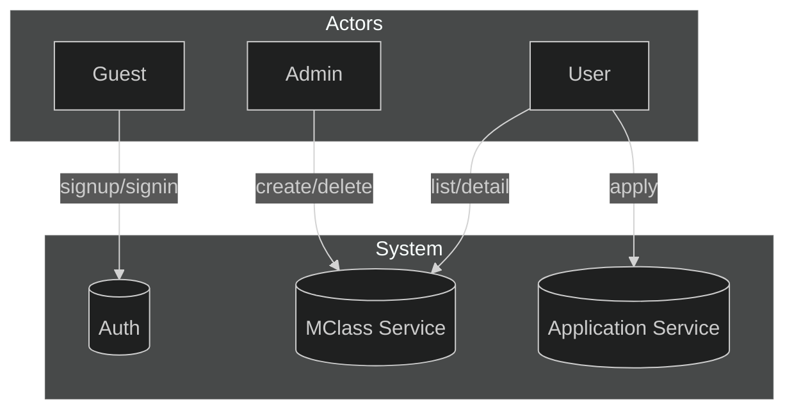
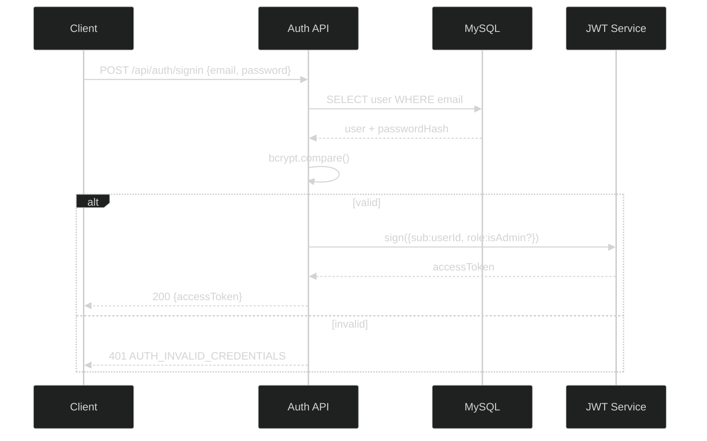
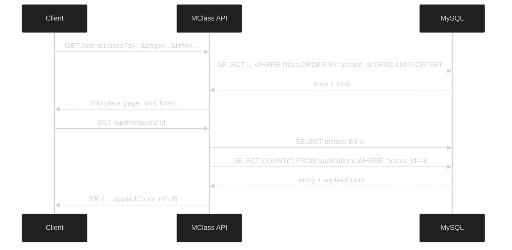
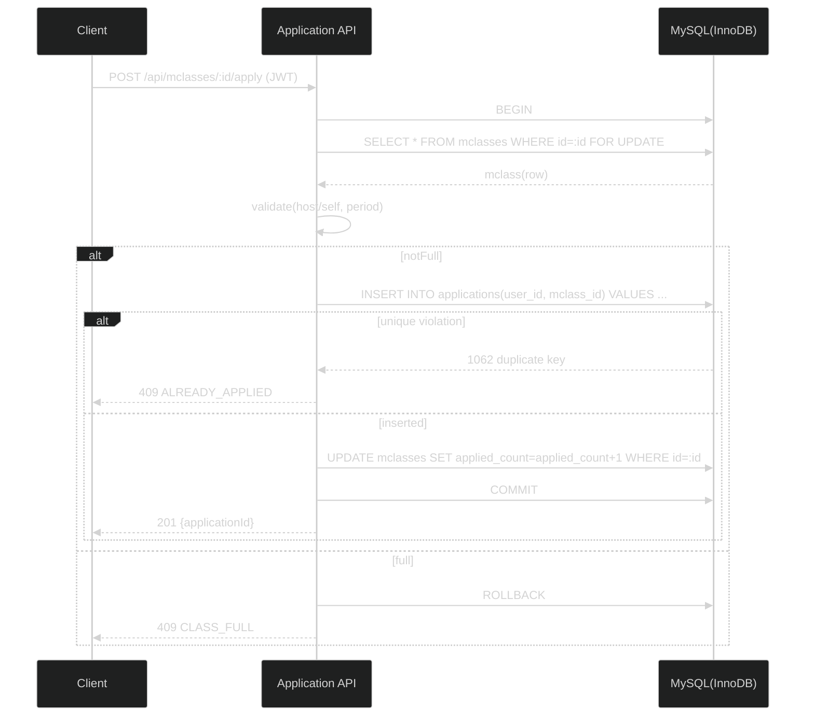
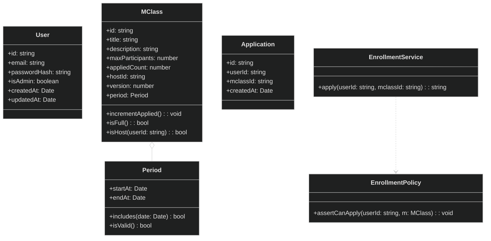
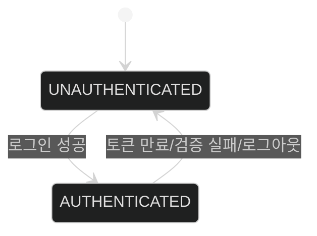
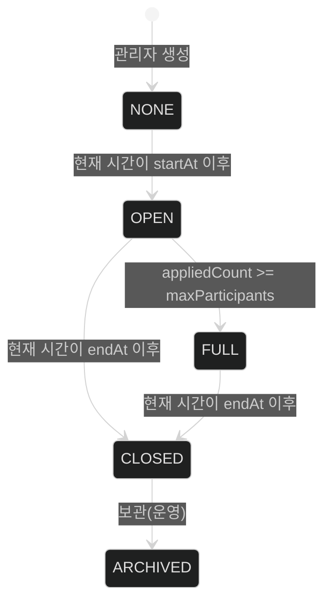
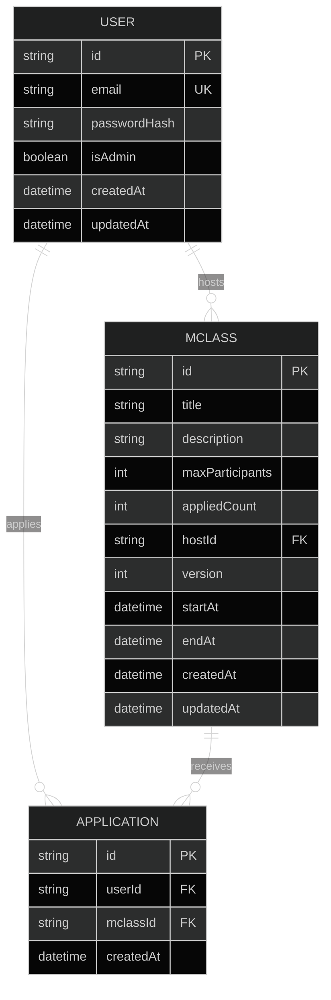

## 베스트 프랙티스 설계서 (v2)

본 문서는 사전과제의 요구사항을 기반으로, 실서비스 수준의 보안/성능/동시성을 고려한 베스트 프랙티스 설계를 제시합니다. `Node.js + TypeScript + Express`와 `MySQL 8`을 기본 가정으로 하며, 동시성 설계는 내부 레퍼런스 `hhplus-concert-ticketing-service`의 락/버전 관리 아이디어를 반영했습니다. DDD 관점의 모델링은 `part-2-학사관리시스템-수강신청` 구조를 참고했습니다.

## 1. 요구사항 분석

### 1.1 도메인/역할/용어
- 사용자 역할: Guest(비회원), User(일반), Host(개설자), Admin(관리자)
- 핵심 개념: `MClass(강의)`, `Application(신청)`, `User(사용자)`
- 파생 개념: 정원(`maxParticipants`), 현재 신청 수(`appliedCount` 집계 또는 `Application` 카운트), 기간(`startAt`/`endAt`)

### 1.2 기능 요구사항(8개 API)
- Auth: 회원가입 `POST /api/auth/signup`, 로그인 `POST /api/auth/signin`
- User: 내 신청내역 `GET /api/users/me/applications`
- MClass(User): 목록 `GET /api/mclasses`, 상세 `GET /api/mclasses/:id`, 신청 `POST /api/mclasses/:id/apply`
- MClass(Admin/Host): 생성 `POST /api/internal/mclasses`, 삭제 `DELETE /api/internal/mclasses/:id`

### 1.3 제약/가정
- 인증: JWT Bearer, 비밀번호는 `bcrypt` 해시 저장
- 데이터 건수: `MClass` 수만~수십만, `Application` 수백만 가정
- 중복 신청 방지: `(userId, mclassId)` 유니크 제약
- 정원 초과 방지: 트랜잭션 + 락/버전으로 보호
- 정책: 호스트 본인 수강 신청 불가, 삭제는 `Admin` 또는 소유자만

### 1.4 비기능 요구사항
- 보안: 입력 검증, 비밀번호 안전 저장, 최소 권한(인가), 토큰 만료/회수 전략
- 성능: 인덱스/페이징 최적화, N+1 방지, 캐시 고려(선택)
- 동시성: 단일 DB 트랜잭션으로 임계구역 보호, 데드락 재시도, 유니크 충돌 처리
- 가용성/운영: 헬스체크, 표준 에러 포맷 `{code, message, details?}`, 구조적 로깅

### 1.5 동시성 정책(권장안)
- 기본: InnoDB 트랜잭션 + `SELECT ... FOR UPDATE`로 대상 `MClass` 행 잠금 → 정원 확인 → `Application` INSERT(유니크 보장) → 필요 시 `MClass.applied_count` 증가 → 커밋
- 대안(낙관적): `MClass.version`을 조건으로 UPDATE(`WHERE id=? AND version=?`)하여 정원 증감 시 버전 충돌을 감지(충돌 시 재시도)
- 운영 팁: 데드락/락타임아웃은 1~3회 재시도, 응답은 409(CONFLICT)로 표준화

## 2. 유스케이스



요약
- Guest: 회원가입/로그인
- User: 목록/상세/신청, 내 신청내역
- Admin: M클래스 생성/삭제

## 3. 시퀀스 다이어그램

### 3.1 로그인(Signin)


### 3.2 m클래스 목록/상세


### 3.3 신청(Apply) - 트랜잭션/락


## 4. 도메인 관점 클래스 다이어그램



설명
- 애그리게잇 루트: `MClass`(정원/버전/정책 연관). 신청은 `Application`으로 분리되지만, 정원 검사는 `MClass` 기준으로 보호
- 도메인 서비스 `EnrollmentPolicy`는 호스트 본인 신청 금지, 기간 유효성 등을 캡슐화

## 5. 상태 다이어그램

### 5.1 인증 상태


### 5.2 m클래스 라이프사이클(파생)


## 6. API 정의서(요약)

- 공통: 응답 에러 포맷 `{code, message, details?}`. 인증이 필요한 API는 `Authorization: Bearer <token>`

### Auth API
1) POST `/api/auth/signup`
   - Auth: Public
   - Body: `{ email: string, password: string }`
   - 201: `{ userId: string }`
   - 409: `CONFLICT_DUPLICATE_EMAIL`, 400: `VALIDATION_ERROR`

2) POST `/api/auth/signin`
   - Auth: Public
   - Body: `{ email: string, password: string }`
   - 200: `{ accessToken: string }`
   - 401: `AUTH_INVALID_CREDENTIALS`, 400: `VALIDATION_ERROR`

### User API
1) GET `/api/users/me/applications`
   - Auth: Required
   - Query: `page?, limit?`
   - 200: `{ data: Application[], page, limit, total }`
   - 401: `AUTH_REQUIRED`

### M클래스 API - 유저
1) GET `/api/mclasses`
   - Auth: Optional
   - Query: `q?, hostId?, from?, to?, page=1, limit<=100`
   - 200: `{ data: MClass[], page, limit, total }`

2) GET `/api/mclasses/:id`
   - Auth: Optional
   - 200: `MClassDetail & { appliedCount: number, isFull: boolean }`
   - 404: `MCLASS_NOT_FOUND`

3) POST `/api/mclasses/:id/apply`
   - Auth: Required
   - 201: `{ applicationId: string }`
   - 400: `HOST_CANNOT_APPLY`, 404: `MCLASS_NOT_FOUND`
   - 409: `ALREADY_APPLIED | CLASS_FULL`

### M클래스 API - 내부용
4) POST `/api/internal/mclasses`
   - Auth: Required(Host/Admin)
   - Body: `{ title, description?, maxParticipants, startAt?, endAt? }`
   - 201: `{ id: string }`
   - 400: `VALIDATION_ERROR`

5) DELETE `/api/internal/mclasses/:id`
   - Auth: Required(Admin or Owner)
   - 204: no body
   - 403: `CLASS_FORBIDDEN`, 404: `MCLASS_NOT_FOUND`

## 7. 논리/물리 ERD 설계 (MySQL 8)

### 7.1 논리 ERD


### 7.2 물리 설계(DDL 스케치)
```sql
CREATE TABLE users (
  id bigint PRIMARY KEY,
  createdAt DATETIME(6) NOT NULL,
  updatedAt DATETIME(6) NOT NULL,
  email VARCHAR(255) NOT NULL UNIQUE,
  passwordHash VARCHAR(100) NOT NULL,
  isAdmin TINYINT(1) NOT NULL DEFAULT 0,
  INDEX idx_users_created_at (createdAt)
) ENGINE=InnoDB DEFAULT CHARSET=utf8mb4;

CREATE TABLE mclasses (
  id bigint PRIMARY KEY,
  createdAt DATETIME(6) NOT NULL,
  updatedAt DATETIME(6) NOT NULL,
  title VARCHAR(200) NOT NULL,
  description TEXT NULL,
  maxParticipants INT UNSIGNED NOT NULL,
  appliedCount INT UNSIGNED NOT NULL DEFAULT 0,
  hostId CHAR(26) NOT NULL,
  version INT UNSIGNED NOT NULL DEFAULT 0,
  startAt DATETIME(6) NULL,
  endAt DATETIME(6) NULL,
  CONSTRAINT fk_mclass_host FOREIGN KEY (hostId) REFERENCES users(id),
  INDEX idx_mclasses_host (hostId),
  INDEX idx_mclasses_period (startAt, endAt),
  FULLTEXT INDEX ftx_mclasses_title (title)
) ENGINE=InnoDB DEFAULT CHARSET=utf8mb4;

CREATE TABLE applications (
  id bigint PRIMARY KEY,
  createdAt DATETIME(6) NOT NULL,
  updatedAt DATETIME(6) NOT NULL,
  userId bigint NOT NULL,
  mclassId bigint NOT NULL,
  CONSTRAINT fk_app_user FOREIGN KEY (userId) REFERENCES users(id),
  CONSTRAINT fk_app_class FOREIGN KEY (mclassId) REFERENCES mclasses(id),
  UNIQUE KEY uk_app_user_class (userId, mclassId),
  INDEX idx_app_user (userId),
  INDEX idx_app_class (mclassId)
) ENGINE=InnoDB DEFAULT CHARSET=utf8mb4;
```

인덱스/동시성 메모
- `uk_app_user_class`로 중복 신청 방지
- 신청 트랜잭션에서 `SELECT ... FOR UPDATE`로 대상 `mclasses` 행 잠금 후 `applied_count` 갱신
- 대체안: `applied_count` 미보유 시 `SELECT COUNT(*) FROM applications WHERE mclass_id=?`를 사용하되, 트랜잭션 내 일관성 보장 필요
- `version` 칼럼은 낙관적 락(확장 시) 적용 가능

## 8. 운영/품질 가이드(요약)
- 환경변수 검증 후 부팅 실패 전략(불완전 구성 차단)
- 표준 에러 코드: AUTH_INVALID_CREDENTIALS, AUTH_REQUIRED, MCLASS_NOT_FOUND, CLASS_FORBIDDEN, CLASS_FULL, ALREADY_APPLIED, HOST_CANNOT_APPLY, CONFLICT_DUPLICATE_EMAIL, VALIDATION_ERROR
- 테스트: 단위/통합에서 동시 신청 케이스, 유니크 충돌, 정원 경합, 권한 확인
